# Water Meter Quality Inspection

基于 FPGA + RK3588 异构架构的机械水表质检软硬协同动态核验系统。

项目主链路：

```text
SC1336 DVP 相机
  -> FPGA ISP / DDR3 / HDMI
  -> RK3588 HDMI 采集
  -> YOLO11-pose RKNN 推理
  -> Web 实时质检界面
  -> 指针角度 / 圈数 / 经过水量 m3
```

本仓库只整理可公开的核心工程代码、训练脚本、RK3588 部署脚本和技术文档。原始数据集、Labelme 工作目录、训练输出、模型权重、RKNN 模型、wheels、压缩包和 Vivado 生成物不纳入 Git。

## 系统结构

```mermaid
flowchart LR
    A["SC1336 DVP Camera"] --> B["FPGA DVP Capture"]
    B --> C["DDR3 Frame Buffer"]
    C --> D["RAW8 -> RGB888"]
    D --> E["AWB / Gain / Brightness / Crop"]
    E --> F["HDMI 1280x720@60"]
    F --> G["RK3588 V4L2 /dev/video73"]
    G --> H["YOLO11-pose RKNN"]
    H --> I["Center / Tip / Angle"]
    I --> J["Turns / m3 Calculation"]
    J --> K["Local Web Dashboard"]
```



## 目录结构

```text
.
├── fpga/
│   └── sc1336_hdmi_isp/          # FPGA 主工程核心源码和 Vivado 工程定义
│       ├── rtl/                  # DVP、DDR、HDMI、UART、ISP RTL
│       └── prj/                  # .xpr、约束、IP xci/mig 配置、Tcl
├── rk3588/
│   ├── web/                      # RK3588 HDMI/RKNN/Web 推理服务
│   └── native/                   # RKNN C++ benchmark / RKNN API 头文件
├── training/
│   ├── scripts/                  # 标注整理、YOLO 数据转换、训练脚本
│   └── configs/                  # YOLO pose 数据集配置模板
├── tools/
│   └── labeling/                 # Labelme 启动辅助脚本
├── docs/                         # 技术文档、使用手册、博客稿
├── LICENSE
└── README.md
```

## FPGA 主工程

Vivado 工程：

```text
fpga/sc1336_hdmi_isp/prj/sc1336_hdmi.xpr
```

核心 RTL：

| 文件 | 作用 |
| --- | --- |
| `fpga/sc1336_hdmi_isp/rtl/sc1336_hdmi.sv` | 顶层链路、模式切换、UART ISP 参数 |
| `fpga/sc1336_hdmi_isp/rtl/axi4_ctrl.sv` | DDR3 AXI4 帧缓存读写 |
| `fpga/sc1336_hdmi_isp/rtl/i2c_sc1336_config.v` | SC1336 初始化配置 |
| `fpga/sc1336_hdmi_isp/rtl/Sensor_Image_XYCrop.sv` | DVP 输入裁剪 |
| `fpga/sc1336_hdmi_isp/rtl/isp/VIP_RAW8_RGB888.v` | RAW8 Bayer 转 RGB888 |
| `fpga/sc1336_hdmi_isp/rtl/isp/FrameBoundCrop.v` | HDMI 输出边界裁剪 |

推荐串口测试顺序：

```text
L  -> HDMI 基础测试图
D  -> DDR 动态测试图
R  -> 相机 RAW 灰度
I  -> RGB 去马赛克
C  -> 推荐检测模式，RGB + 白平衡/亮度 + crop
```

常用 ISP 调参：

```text
a / z  全局增益增加 / 减少
+ / -  亮度增加 / 减少
w      恢复默认白平衡和亮度
r / f  红色增益增加 / 减少
g / v  绿色增益增加 / 减少
b / n  蓝色增益增加 / 减少
```

## 训练与数据转换

训练脚本统一放在：

```text
training/scripts/
```

常用流程：

```bash
# 1. 从已有 Labelme 矩形框粗略生成 center/tip 点
python training/scripts/bootstrap_pose_labels.py --overwrite

# 2. 生成只含单类点的手动修正目录
python training/scripts/make_point_edit_workdirs.py --overwrite

# 3. 合并 center 或 tip 修正结果
python training/scripts/merge_point_edit_workdir.py --edit-dir data/original_dataset/labelme_tip_edit --label tip --backup
python training/scripts/merge_point_edit_workdir.py --edit-dir data/original_dataset/labelme_center_edit --label center --backup

# 4. 转换为 YOLO11-pose 数据集
python training/scripts/convert_labelme_pose_to_yolo.py --clean
```

YOLO pose 配置模板：

```text
training/configs/water_meter_pose.yaml
```

类别定义：

```text
0: 10^-1
1: 10^-2
2: 10^-3
3: 10^-4
```

关键点定义：

```text
kpt_shape: [2, 3]
0: center
1: tip
```

## RKNN 转换与 RK3588 部署

RK3588 Web 推理代码：

```text
rk3588/web/
```

RK3588 端推荐部署目录：

```text
/home/demo/water_meter/
├── code/
│   ├── hdmi_yolo11_pose_web.py
│   ├── hdmi_yolo11_pose_detect.py
│   ├── hdmi_rknn_detect.py
│   └── usb_rknn_detect.py
├── module/
│   ├── water_meter_yolo11n_pose_fp.rknn
│   └── int8_variants/
│       └── water_meter_yolo11n_pose_int8_headrs_float_normal.rknn
└── run_hdmi_yolo11_pose_web.sh
```

启动 Web 服务：

```bash
cd /home/demo/water_meter
./run_hdmi_yolo11_pose_web.sh
```

浏览器访问：

```text
http://<RK3588-IP>:6008/
```

模型模式：

| 模式 | 说明 |
| --- | --- |
| `accuracy` | FP RKNN，关键点更稳，推荐用于正式水量测量 |
| `fast` | INT8 hybrid RKNN，帧率更高，适合预览 |

快速模式：

```bash
WM_MODEL_MODE=fast ./run_hdmi_yolo11_pose_web.sh
```

## 水量计算

系统不是把四个小表盘结果简单相加，而是从用户点击“开始测量/清零”的时刻开始，对选定表盘连续跟踪角度变化并累计圈数。

当前水量约定：

| 表盘 | 每小格 | 每圈水量 |
| --- | --- | --- |
| `10^-1` | 0.1 m3 | 1.0 m3 |
| `10^-2` | 0.01 m3 | 0.1 m3 |
| `10^-3` | 0.001 m3 | 0.01 m3 |
| `10^-4` | 0.0001 m3 | 0.001 m3 |

如果现场安装方向导致读数反向，可在 Web 页面中对单个表盘切换“正向/反向”。

## 文档入口

| 文档 | 说明 |
| --- | --- |
| `docs/Blog_FPGA_RK3588_WaterMeter_HDMI_YOLO11_Pose.md` | 面向技术博客发布的完整项目文章 |
| `docs/Technical_Blog_Full.md` | 全链路技术博客详解 |
| `docs/FPGA_ISP_RK3588_WaterMeter_Technical_Doc.md` | FPGA + RK3588 技术文档 |
| `docs/FPGA_ISP_RK3588_WaterMeter_User_Manual.md` | 使用手册 |
| `docs/RK3588_WaterMeter_Quick_Start.md` | RK3588 快速启动 |
| `docs/ISP_UART_Debug.md` | FPGA UART ISP 调试说明 |
| `docs/DDR3_AXI4_Implementation_Guide.md` | DDR3 AXI4 实现说明 |

## 不包含在 Git 中的内容

以下文件保留在本地或外部存储，不进入 GitHub：

- 原始数据集：`data/original_dataset/`
- Labelme 编辑工作目录：`labelme_*_edit/`
- YOLO 训练输出：`runs/`、`data/yolo11*_pointer*/`
- 权重和模型：`.pt`、`.onnx`、`.rknn`
- RKNN wheels 和离线安装包：`rknn_wheels/`
- Vivado 生成物：`.runs/`、`.cache/`、`.gen/`、`.hw/`

## 版本记录

### V0.2.0

- 整理 FPGA + RK3588 + YOLO11-pose + Web 全链路工程结构。
- 移出 Git 跟踪中的原始数据集和权重文件。
- 增加 RK3588 Web 推理源码和 RKNN benchmark 代码。
- 增加完整技术博客和使用文档入口。

### V0.1.2

- 补充早期检测训练脚本和测试结果说明。

### V0.1.1

- 增加训练脚本和冒烟测试流程。

### V0.1.0

- 初始水表数据集验证与传统视觉角度估计实验。
