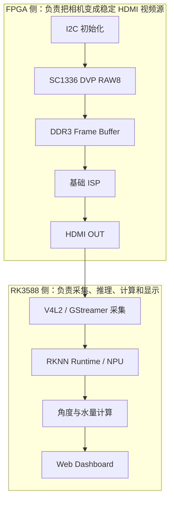
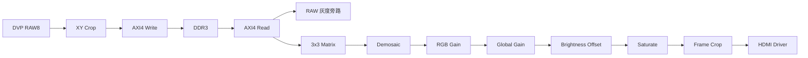
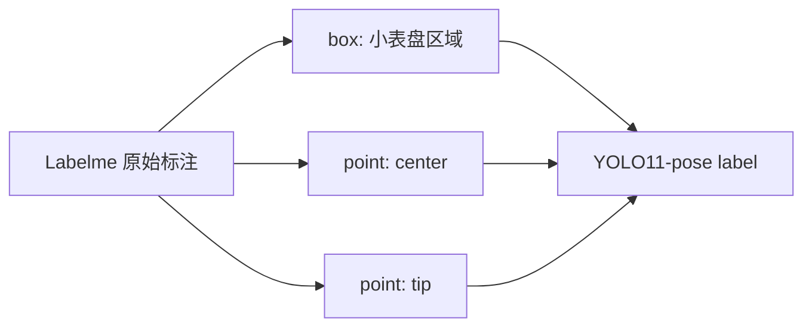
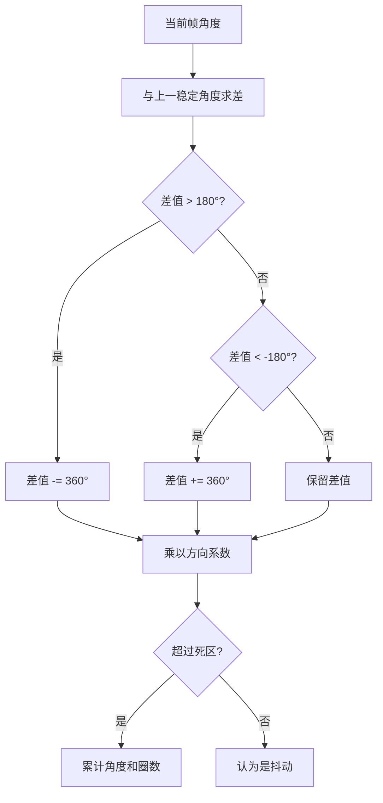
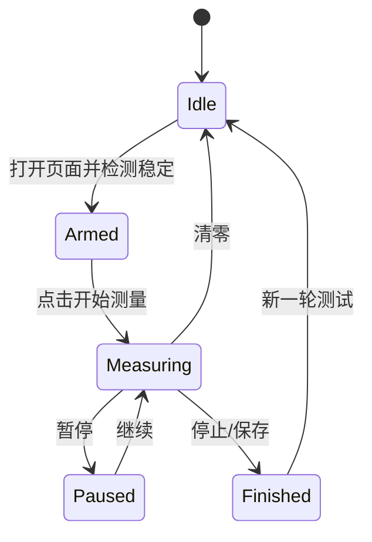
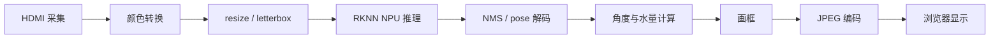

这篇文章记录一个真实硬件项目的端到端搭建过程：前端用 FPGA 接入 SC1336 DVP 相机，完成相机初始化、DDR3 帧缓存、基础 ISP 和 HDMI 输出；后端用 RK3588 接收 HDMI 视频流，调用 YOLO11-pose RKNN 模型检测水表小表盘中心与指针尖端，最后在本地 Web 页面上计算指针角度、累计圈数和经过水量。

项目对应的开源整理仓库已经放在 GitHub：

[ORI2333/Water-meter-quality-inspection](https://github.com/ORI2333/Water-meter-quality-inspection)

这不是一个单纯的“识别水表读数”Demo。真正的目标是动态质检：在某个测试时刻开始计量，让水表实际通水，系统持续观察指针运动，判断水表是否按预期转动，并计算本次经过的水量。也就是说，系统要同时解决成像、视频链路、模型推理、关键点稳定、角度展开、进制换算和 Web 交互这些问题。

<!-- more -->

## 1. 项目目标

机械水表的质检场景和普通图像识别不太一样。普通读数任务只关心某一帧图片上显示了多少；动态质检更关心“从开始测试到当前时刻，水表实际走了多少”。

因此这个系统被拆成四个目标：

1. 视频链路稳定：FPGA 必须持续输出标准 HDMI，RK3588 必须稳定采集。
2. 画面质量可控：曝光、亮度、白平衡不能让模型输入忽明忽暗。
3. 指针检测稳定：静态水表时关键点不能乱飘，动态时不能丢帧严重。
4. 水量计算正确：四个小表盘是进制关系，不能把四个角度简单相加。

最终希望达到的使用方式很简单：打开 Web 页面，确认水表画面正常，点击开始测量，系统持续显示角度、圈数和本次经过水量。

## 2. 仓库结构

为了把硬件、软件、训练和文档整理到一个可交付工程中，仓库按功能拆成几个目录。

```text
Water-meter-quality-inspection
├── fpga/
│   └── sc1336_hdmi_isp/
│       ├── rtl/
│       └── prj/
├── rk3588/
│   ├── web/
│   └── native/
├── training/
│   ├── configs/
│   └── scripts/
├── tools/
│   └── labeling/
├── docs/
└── README.md
```

对应关系如下：

| 目录 | 作用 |
| --- | --- |
| `fpga/sc1336_hdmi_isp/` | FPGA 主工程核心文件，包括 RTL、Vivado 工程、约束和 IP 配置 |
| `rk3588/web/` | RK3588 HDMI 采集、RKNN 推理和 Web 服务 |
| `rk3588/native/` | RKNN C++ benchmark，用于验证纯推理速度上限 |
| `training/scripts/` | Labelme 标注整理、YOLO pose 数据集转换、训练辅助脚本 |
| `training/configs/` | YOLO11-pose 数据集配置 |
| `tools/labeling/` | Labelme 辅助启动脚本 |
| `docs/` | 技术文档、使用手册、调试说明和博客稿 |

仓库没有包含原始数据集、训练权重、ONNX、RKNN、Vivado 生成目录和压缩包。这些文件体积大，也不适合直接公开放进 Git。

## 3. 总体架构

系统采用 FPGA + RK3588 的异构架构。FPGA 负责实时视频链路和前端图像预处理，RK3588 负责 AI 推理、Web 展示和水量计算。

```mermaid
flowchart LR
    A["SC1336 DVP 相机"] --> B["FPGA DVP 接收"]
    B --> C["DDR3 帧缓存"]
    C --> D["RAW8 Bayer 读出"]
    D --> E["RAW8 -> RGB888 去马赛克"]
    E --> F["白平衡 / 增益 / 亮度 / 裁剪"]
    F --> G["HDMI 1280x720@60"]
    G --> H["RK3588 HDMI 采集"]
    H --> I["YOLO11-pose RKNN 推理"]
    I --> J["中心点 / 针尖 / 角度"]
    J --> K["角度展开 / 圈数累计"]
    K --> L["m3 水量换算"]
    L --> M["本地 Web 质检界面"]
```



从调试角度看，这条链路可以分为两段：



这种分工的好处是边界清楚。FPGA 只需要保证 HDMI 输出是稳定视频，RK3588 就可以把它当成一个普通视频采集源来处理。模型、Web、UI、计算逻辑的迭代不会破坏 FPGA 工程时序。

## 4. 为什么 FPGA 和 RK3588 之间选择 HDMI

FPGA 和 RK3588 之间理论上可以有很多连接方式，比如 MIPI、并口、PCIe、网络或者共享存储。但在这个项目里，HDMI 是比较务实的选择。

HDMI 的优点：

1. 标准化强，FPGA 输出后可以直接接显示器看画面。
2. RK3588 端可以通过视频采集节点读取，软件侧调试简单。
3. FPGA 和 RK 软件边界清楚，前后端可以独立迭代。
4. 出问题时可以快速判断：显示器画面正常而 Web 异常，问题多半在 RK 侧；显示器也异常，先查 FPGA 和相机链路。

HDMI 的缺点也存在：

1. RK 采集到的是经过 HDMI 链路和采集驱动后的图像，不等于 FPGA 内部原始像素。
2. Web 端如果用 MJPEG 推流，还会再次压缩，浏览器看起来可能比 HDMI 直连显示器更糊。
3. 如果要极致低延迟和高画质，后续可以考虑 V4L2 DMABUF、硬件编码或更底层的 C++ 管线。

当前阶段先把工程跑通、把测量闭环做出来，比追求极限视频链路更重要。

## 5. FPGA 端设计

FPGA 工程放在：

```text
fpga/sc1336_hdmi_isp/
```

Vivado 工程入口：

```text
fpga/sc1336_hdmi_isp/prj/sc1336_hdmi.xpr
```

关键 RTL：

| 文件 | 作用 |
| --- | --- |
| `rtl/sc1336_hdmi.sv` | 顶层模块，连接相机、DDR3、ISP、HDMI、UART |
| `rtl/i2c_sc1336_config.v` | SC1336 初始化寄存器配置 |
| `rtl/Sensor_Image_XYCrop.sv` | DVP 输入裁剪 |
| `rtl/axi4_ctrl.sv` | DDR3 AXI4 帧缓存读写 |
| `rtl/isp/VIP_RAW8_RGB888.v` | RAW8 Bayer 转 RGB888 |
| `rtl/isp/VIP_Matrix_Generate_3X3_8Bit.v` | 3x3 窗口生成 |
| `rtl/isp/Line_Shift_RAM_8Bit.v` | 行缓存 |
| `rtl/isp/FrameBoundCrop.v` | 输出边界裁剪 |
| `rtl/uart_rx.v` / `rtl/uart_tx.v` | 串口调试入口 |

### 5.1 相机输入

当前使用的是 SC1336 DVP 相机。DVP 输入信号主要包括：

| 信号 | 说明 |
| --- | --- |
| `cmos_pclk` | 像素时钟 |
| `cmos_vsync` | 帧同步 |
| `cmos_href` | 行有效 |
| `cmos_db[7:0]` | 8-bit RAW 数据 |
| `cmos_scl/cmos_sda` | I2C 配置 |
| `cmos_xclk` | FPGA 输出给相机的主时钟 |

相机输出的是 RAW8 Bayer 数据。此时图像还不是 RGB，直接显示只能看到灰度或马赛克效果。想要给 RK3588 和模型一个更接近自然图像的输入，需要在 FPGA 侧做基础 ISP。

### 5.2 为什么 DDR3 中存 RAW8

这个工程选择把 RAW8 写入 DDR3，而不是把 RGB888 写入 DDR3。

这样做的主要原因是带宽和调试稳定性：

1. RAW8 每个像素 8 bit，RGB888 每个像素 24 bit，RAW8 对 DDR 压力更小。
2. 原始灰度链路更容易先跑通，后续 ISP 可以挂在读出侧。
3. 串口模式可以随时切回 RAW 灰度，快速判断相机和 DDR 是否正常。
4. 对水表检测任务来说，基础去马赛克和亮度调节已经足够支撑模型输入。

FPGA 内部数据流可以理解为：



### 5.3 基础 ISP

当前 FPGA 侧 ISP 重点不是做复杂画质算法，而是解决模型输入的几个刚需：

1. RAW8 转 RGB888。
2. 白平衡可调。
3. 全局增益可调。
4. 亮度偏移可调。
5. 裁掉边界异常像素。

增益使用 Q8.8 表示：

```text
256 = 1.00x
320 = 1.25x
384 = 1.50x
512 = 2.00x
```

像素处理逻辑：

```text
R1 = R0 * R_GAIN / 256
G1 = G0 * G_GAIN / 256
B1 = B0 * B_GAIN / 256

R2 = R1 * ALL_GAIN / 256
G2 = G1 * ALL_GAIN / 256
B2 = B1 * ALL_GAIN / 256

R_OUT = saturate(R2 + BRIGHTNESS)
G_OUT = saturate(G2 + BRIGHTNESS)
B_OUT = saturate(B2 + BRIGHTNESS)
```

这里的 `saturate` 是限幅，避免加亮或增益后溢出 8 bit。硬件上乘法和加法需要做流水线，否则容易把 HDMI 像素时钟域的组合路径拉长。

### 5.4 串口调试场景

FPGA 端做了 UART 可切换测试场景。这个设计非常关键，因为它能把问题定位拆开。

| 命令 | 现象 | 作用 |
| --- | --- | --- |
| `L` | HDMI/LCD 测试图 | 验证 HDMI 显示链路 |
| `D` | DDR 动态测试图 | 验证 DDR 写读和读出节奏 |
| `R` | 相机 RAW 灰度 | 验证 SC1336 输入 |
| `I` | RGB 去马赛克 | 验证 Bayer 相位和 RGB 处理 |
| `C` | 检测推荐模式 | RGB + 白平衡/亮度 + 裁剪 |

常用 ISP 调参：

```text
a / z  全局增益增加 / 减少
+ / -  亮度增加 / 减少
w      恢复默认白平衡和亮度
r / f  红色增益增加 / 减少
g / v  绿色增益增加 / 减少
b / n  蓝色增益增加 / 减少
```

调试顺序建议是 `L -> D -> R -> I -> C`。如果 `L` 都不正常，就不要看模型；如果 `R` 正常但 `I` 颜色不对，重点查 Bayer 相位；如果 HDMI 显示器正常但 Web 模糊，重点查 RK 采集和 Web 推流。

### 5.5 暗光延迟问题

调试时出现过一个很典型的现象：正常光照下画面显示和检测都正常，一到暗光环境，画面就出现严重延迟和拖影。

这个问题的根因通常不是 RKNN 慢，也不是 Web 慢，而是相机自动曝光把曝光时间拉得太长。曝光时间越长，单帧积分时间越长，运动指针就会出现拖影，用户看到的现象就是“延迟很大”。

解决方向：

1. 限制 SC1336 最大曝光时间。
2. 用 FPGA 的全局增益和亮度补偿暗部。
3. 给水表加稳定补光。
4. 后续加入 Gamma、对比度增强和锐化。

对于动态质检来说，实时性和边缘清晰度比单纯把画面提亮更重要。

## 6. RK3588 端设计

RK3588 端代码放在：

```text
rk3588/web/
```

主要文件：

| 文件 | 作用 |
| --- | --- |
| `hdmi_yolo11_pose_web.py` | Web 服务、MJPEG 视频流、控制接口、水量计算 |
| `hdmi_yolo11_pose_detect.py` | HDMI 采集 + YOLO11-pose RKNN 推理 |
| `hdmi_rknn_detect.py` | 早期 HDMI RKNN 检测脚本 |
| `usb_rknn_detect.py` | USB 摄像头测试脚本 |
| `convert_best_to_rknn.py` | ONNX/RKNN 转换辅助 |
| `debug_compare_int8_outputs.py` | INT8 输出对比调试 |
| `run_hdmi_yolo11_pose_web.sh` | RK3588 端启动脚本 |

推荐部署目录：

```text
/home/demo/water_meter/
├── code/
│   ├── hdmi_yolo11_pose_web.py
│   ├── hdmi_yolo11_pose_detect.py
│   └── convert_best_to_rknn.py
├── module/
│   ├── water_meter_yolo11n_pose_fp.rknn
│   └── int8_variants/
│       └── water_meter_yolo11n_pose_int8_headrs_float_normal.rknn
└── run_hdmi_yolo11_pose_web.sh
```

启动方式：

```bash
cd /home/demo/water_meter
./run_hdmi_yolo11_pose_web.sh
```

浏览器访问：

```text
http://<RK3588-IP>:6008/
```

### 6.1 HDMI 采集

RK3588 侧把 FPGA 输出的 HDMI 当成视频采集源。典型链路是：

```text
v4l2src device=/dev/videoXX
  -> video/x-raw,format=BGR,width=1280,height=720,framerate=60/1
  -> videoconvert
  -> appsink
```

实际设备号需要根据板子枚举结果确定。调试时建议先确认：

```bash
v4l2-ctl --list-devices
v4l2-ctl -d /dev/videoXX --list-formats-ext
```

如果设备被占用，可以用：

```bash
fuser /dev/videoXX
```

确认占用进程后再停止旧服务。

### 6.2 RKNN 与 NPU

模型部署到 RK3588 后，通过 RKNN Runtime 调用 NPU 推理。代码中会打印 RKNN Runtime、驱动版本、模型输入尺寸等信息。

如果日志里能看到类似 RKNN Runtime 和 RKNN Driver 信息，说明模型确实走了 RKNN Runtime。真正是否跑在 NPU 上，还要看模型是否成功初始化到 RKNNLite，并且不是 Python 里用 CPU 框架推理。

项目中保留了两类模型模式：

| 模式 | 模型 | 特点 |
| --- | --- | --- |
| `accuracy` | FP RKNN | 关键点更稳，适合正式测量 |
| `fast` | INT8 hybrid RKNN | 帧率更高，适合预览 |

启动快速模式：

```bash
WM_MODEL_MODE=fast ./run_hdmi_yolo11_pose_web.sh
```

实际测试中，纯 INT8 C++ demo 的 20 到 60 fps 不能直接拿来和 Python + Web 的端到端帧率比较。后者包含 HDMI 采集、颜色转换、resize、NMS、关键点后处理、Web 编码和浏览器显示，瓶颈不只在 NPU。

### 6.3 Web 界面

Web 界面的目标不是单纯显示视频，而是承担现场质检操作台的角色：

1. 显示实时视频。
2. 显示检测框、中心点、针尖。
3. 显示角度、圈数、经过水量。
4. 支持开始、暂停、清零。
5. 支持模型模式切换。
6. 支持表盘方向正反设置。
7. 支持视频尺寸、画质和刷新策略调节。

视频区域中不应该堆太多文字，否则会挡住水表细节。检测框上只保留必要视觉提示，详细数据放到右侧或下方状态区。

## 7. 模型方案：为什么用 YOLO11-pose

一开始尝试传统方法是很自然的：阈值分割、霍夫圆、直线检测、边缘检测等都可以用来找表盘和指针。但真实环境下这些方法很难稳定：

1. 水表玻璃反光会改变边缘。
2. 指针很细，容易和刻度线混在一起。
3. 光照变化会让阈值失效。
4. 透视角度和安装偏差会影响圆检测。
5. 多个小表盘之间外观相似，传统规则容易串。

所以最终采用 YOLO11-pose：让模型同时输出小表盘位置、中心点和针尖点，再用几何关系计算角度。

### 7.1 标注定义

类别定义：

```text
0: 10^-1
1: 10^-2
2: 10^-3
3: 10^-4
```

关键点定义：

```text
kpt_shape: [2, 3]
0: center
1: tip
```

每个小表盘标注一个矩形框，外加两个关键点：



### 7.2 标注整理脚本

训练脚本在：

```text
training/scripts/
```

常用流程：

```bash
# 1. 从已有 Labelme 框粗略生成 center/tip 点
python training/scripts/bootstrap_pose_labels.py --overwrite

# 2. 生成只含单类点的手动修正目录
python training/scripts/make_point_edit_workdirs.py --overwrite

# 3. 合并手动修正后的 tip 和 center
python training/scripts/merge_point_edit_workdir.py --edit-dir data/original_dataset/labelme_tip_edit --label tip --backup
python training/scripts/merge_point_edit_workdir.py --edit-dir data/original_dataset/labelme_center_edit --label center --backup

# 4. 转换为 YOLO11-pose 数据集
python training/scripts/convert_labelme_pose_to_yolo.py --clean

# 5. 检查标签
python training/scripts/validate_pointer_labels.py
```

YOLO 数据配置：

```text
training/configs/water_meter_pose.yaml
```

本地可以做数据准备和小规模验证，正式训练建议放到云端 GPU。训练完成后导出 ONNX，再转换 RKNN。

### 7.3 点位稳定性

水表静止时，如果关键点在画面上轻微跳动，角度会被放大成明显波动。系统里需要做稳定处理：

1. 置信度低时不更新角度。
2. 检测框跳变过大时保持上一帧。
3. 对 center 和 tip 做平滑。
4. 对角度变化设置死区，小于阈值不累计。
5. 当目标短暂丢失时保留最近稳定值。

这一步非常重要。模型输出不是最终测量结果，只是测量算法的观测值。

## 8. 角度、圈数和水量计算

模型输出中心点和针尖点后，角度计算很直接：

```text
dx = tip_x - center_x
dy = tip_y - center_y
angle = atan2(dy, dx)
```

但实际难点不在单帧角度，而在连续角度展开。指针从 359 度转到 1 度时，真实变化是 +2 度，不是 -358 度。

因此需要做 unwrap：



### 8.1 正反方向

不同安装方向、摄像头镜像、表盘旋向都会影响角度方向。如果方向反了，水量可能一直为 0 或变成负数。

所以 Web 页面里需要支持每个表盘单独设置正向/反向。本质上就是给角度增量乘一个方向系数：

```text
signed_delta = raw_delta * direction
```

其中：

```text
direction = +1 或 -1
```

### 8.2 四个表盘的进制关系

机械水表的小表盘不是四个独立传感器，它们是进制关系。

当前按以下约定理解：

| 表盘 | 每小格 | 每圈水量 |
| --- | --- | --- |
| `10^-1` | 0.1 m3 | 1.0 m3 |
| `10^-2` | 0.01 m3 | 0.1 m3 |
| `10^-3` | 0.001 m3 | 0.01 m3 |
| `10^-4` | 0.0001 m3 | 0.001 m3 |

所以最小单位表盘 `10^-4` 转一整圈，对应经过：

```text
0.001 m3
```

同时 `10^-3` 表盘应该前进一小格。这就是进制关系。

动态测量时，不能把四个表盘各自算出的水量简单相加。更合理的做法是：

1. 选择一个主测量表盘，通常选择分辨率最高且检测最稳定的表盘。
2. 用主表盘的角度展开结果计算经过水量。
3. 用相邻更高位表盘做交叉验证，判断进位是否合理。
4. 如果主表盘丢失或置信度低，再考虑降级到其他表盘。

例如选择 `10^-4` 作为主表盘：

```text
volume_m3 = accumulated_turns * 0.001
```

如果只累计角度而不是整圈：

```text
volume_m3 = accumulated_angle / 360.0 * 0.001
```

这样最小表盘转一圈后，水量应该增加 `0.001 m3`，而不是回到 0。

### 8.3 从“读数”到“本次经过水量”

这个系统更适合做“从开始测量到当前时刻的增量水量”，而不是只读绝对表盘值。

典型状态机：



点击开始测量时，系统记录当前角度作为零点。之后只关心角度变化量：

```text
delta_volume = current_volume - start_volume
```

这种方式更符合质检：测试开始前水表绝对读数是多少并不重要，重要的是测试期间有没有按规定流量走动。

## 9. 画质和帧率优化

这个项目里，帧率不是单一指标。需要区分三种帧率：

1. FPGA HDMI 输出帧率。
2. RK3588 采集和模型推理帧率。
3. Web 浏览器显示帧率。

FPGA 可以输出 1280x720@60，但 Web 页面看到的帧率不一定是 60，因为中间还有采集、推理、后处理和编码。

端到端瓶颈大概如下：



### 9.1 为什么 Web 画面比 HDMI 直连糊

HDMI 直连显示器看到的是 FPGA 输出。Web 看到的是 RK 采集后再编码出来的 MJPEG 流。

画质下降主要来自：

1. 采集格式转换。
2. resize 或 letterbox。
3. JPEG 压缩质量。
4. 浏览器端缩放。
5. 推理为了速度可能使用较低输入尺寸。

优化方向：

1. 提高 MJPEG JPEG quality。
2. Web 页面减少视频缩放，让 CSS 尺寸接近真实分辨率比例。
3. 推理使用裁剪 ROI，而不是对整幅 720p 做无差别处理。
4. 预览流和推理流分开，预览保清晰，推理走低分辨率。
5. 后续使用 H.264 硬件编码替代 MJPEG。

### 9.2 FP 和 INT8 的取舍

INT8 量化能提高速度，但关键点模型对量化误差比较敏感。这个项目中发现：帧率上去后，点位识别可能变差，尤其是针尖这种小目标。

因此部署时建议保留两个模式：

| 模式 | 用途 |
| --- | --- |
| FP RKNN | 正式测量，优先保证关键点准确 |
| INT8 hybrid RKNN | 预览和快速演示，优先保证帧率 |

质检系统最终看的是测量可信度，不是单纯 fps 数字。如果 30 fps 下关键点乱飘，不如 10 到 15 fps 但角度稳定。

## 10. 调试方法

调试这类软硬协同项目，最怕所有问题混在一起。我的经验是按层排查。

### 10.1 FPGA 层

先通过串口切模式：

```text
L -> D -> R -> I -> C
```

判断顺序：

1. `L` 正常：HDMI 输出链路基本可用。
2. `D` 正常：DDR3 写读和显示时序基本可用。
3. `R` 正常：相机输入基本可用。
4. `I` 正常：Bayer 转 RGB 基本可用。
5. `C` 正常：推荐检测画面可用。

### 10.2 RK3588 层

确认采集设备：

```bash
v4l2-ctl --list-devices
v4l2-ctl -d /dev/videoXX --list-formats-ext
```

启动 Web：

```bash
cd /home/demo/water_meter
./run_hdmi_yolo11_pose_web.sh
```

访问：

```text
http://<RK3588-IP>:6008/
```

如果打不开页面，先查服务端口；如果页面打开但黑屏，查 V4L2 采集；如果有画面但没框，查模型路径和 RKNN 初始化；如果框有但水量不对，查方向、主表盘选择和进制配置。

### 10.3 模型层

模型问题通常表现为：

1. 框能出，但中心点错。
2. 中心点准，针尖飘。
3. 静态时角度波动。
4. INT8 模式比 FP 模式点位差。

处理方式：

1. 增加相似光照和角度的数据。
2. 针尖点要标得一致，不要一会儿标尖端、一会儿标指针中线。
3. 训练时关注 pose loss，而不只看 box mAP。
4. 转 RKNN 后必须和 PyTorch/ONNX 输出做对比。

## 11. 当前工程状态

目前仓库中已经整理的内容包括：

1. FPGA HDMI + ISP 主工程核心代码。
2. RK3588 HDMI 采集、RKNN 推理和 Web 界面代码。
3. YOLO11-pose 数据准备、标签转换和训练脚本。
4. RKNN 转换、INT8 对比和 C++ benchmark 代码。
5. 技术文档、使用手册、调试说明和本篇博客。

需要注意：

1. 原始数据集没有放进 Git。
2. 模型权重和 RKNN 文件没有放进 Git。
3. Vivado 生成物没有放进 Git。
4. 仓库里的脚本路径尽量使用相对路径，部署到 RK3588 时需要按实际目录放置模型。

## 12. 后续优化方向

这个工程已经形成闭环，但还可以继续优化。

### 12.1 FPGA 侧

1. 增加 Gamma 校正。
2. 增加锐化或边缘增强。
3. 增加更完整的自动白平衡。
4. 对曝光寄存器做更精细的现场配置。
5. 减少或修复 Vivado timing warning。

### 12.2 RK3588 侧

1. 将 Python 后处理迁移到 C++。
2. 使用 RGA 做 resize/颜色转换。
3. 使用硬件编码提升 Web 视频流质量和帧率。
4. 拆分预览流和推理流。
5. 增加检测结果日志导出。

### 12.3 算法侧

1. 扩充不同光照、角度、反光条件的数据集。
2. 增加静态抖动抑制评估指标。
3. 针对针尖小目标做更高分辨率训练或 ROI 二阶段定位。
4. 完善四表盘进位一致性校验。
5. 增加质检判定规则，例如规定时间内水量误差阈值。

## 13. 总结

这个项目的核心并不是“用了 YOLO11”或者“用了 RK3588”，而是把一条真实的硬件视觉链路打通：

```text
SC1336 DVP 相机
  -> FPGA ISP / DDR3 / HDMI
  -> RK3588 HDMI 采集
  -> YOLO11-pose RKNN 推理
  -> Web 实时显示
  -> 指针角度 / 圈数 / m3 动态计算
```

FPGA 保证前端视频稳定，RK3588 提供 AI 算力和交互界面，YOLO11-pose 解决指针关键点检测，角度展开和进制换算把模型输出变成真实水量。每一层都不是孤立的，画质会影响模型，模型会影响角度，角度会影响水量，水量最终决定质检结果。

完整工程见 GitHub：

[https://github.com/ORI2333/Water-meter-quality-inspection](https://github.com/ORI2333/Water-meter-quality-inspection)

