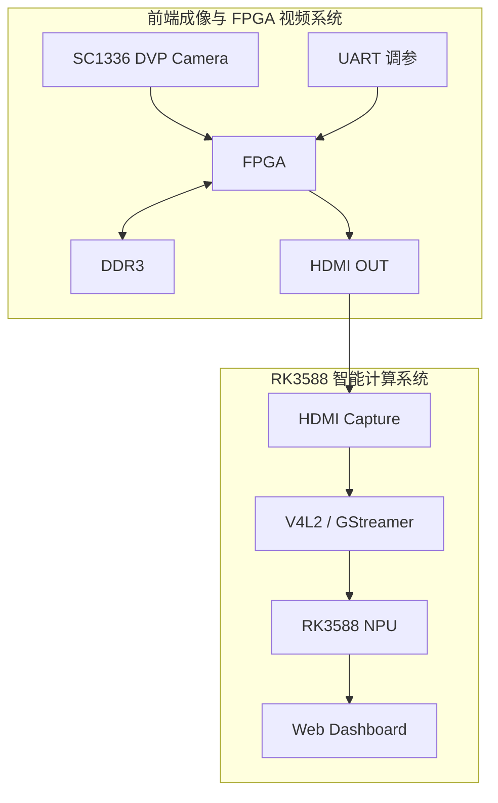
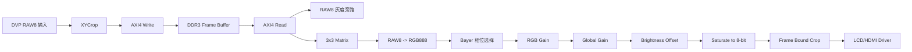
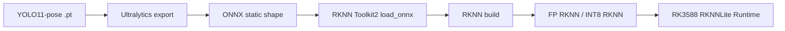
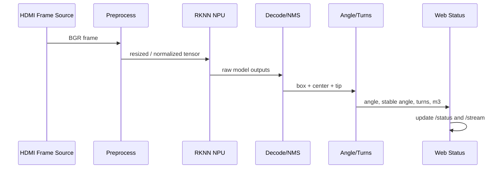
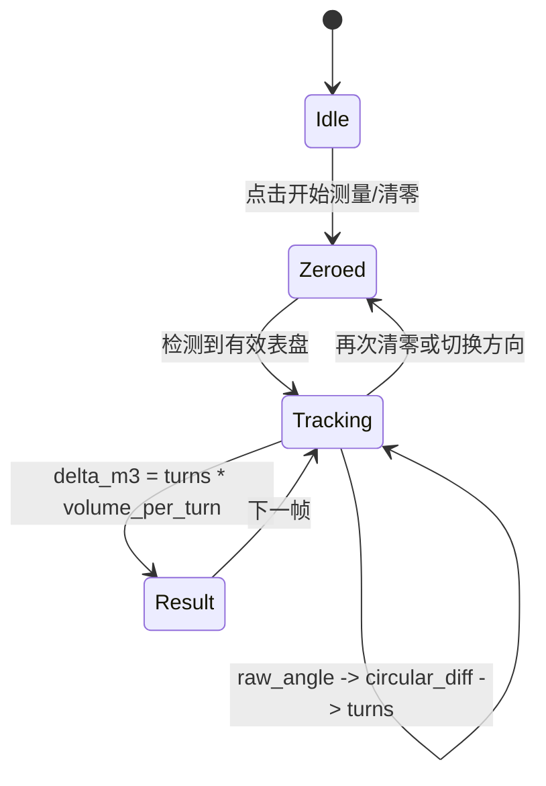
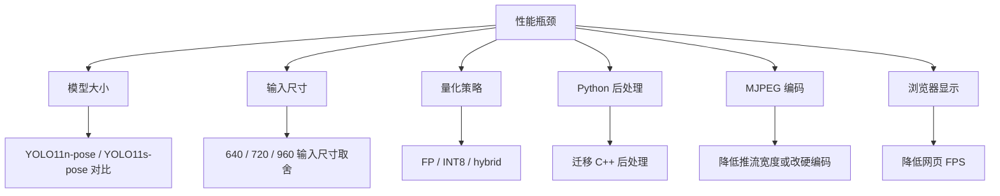

# 基于 FPGA + RK3588 的水表质检系统：从相机采集、ISP、YOLO11-pose 到水量动态核验

这篇文章记录一个完整的嵌入式视觉质检工程：前端使用 SC1336 DVP 相机采集机械水表图像，FPGA 负责相机接入、DDR3 帧缓存、基础 ISP 和 HDMI 输出，RK3588 负责 HDMI 采集、YOLO11-pose RKNN 推理、本地 Web 显示，并进一步计算水表指针角度、累计圈数和经过水量。

项目不是单点算法 demo，而是一条端到端链路。真正的难点分布在每一层：相机曝光会影响延迟，FPGA ISP 会影响模型输入质量，RKNN 量化会影响关键点稳定性，Web 推流会影响画质观感，水表四个小表盘的进制关系会影响最终水量计算。只有把这些环节全部打通，系统才有质检意义。

> 图片建议：文章首图放一张横向拼图，左侧为水表/相机/FPGA/RK3588 实物，右侧为 Web 检测界面，中间用箭头标出视频和数据流。

## 1. 系统目标

机械水表质检关注的不是“识别一张静态图片上的读数”这么简单。更典型的需求是：从某个测试时间点开始，让水表经过一定流量，系统自动判断指针是否按预期转动，并计算本次经过的水量。

因此系统目标被拆成四层：

1. 前端成像稳定：相机画面不能严重拖影，不能暗到模型看不清，颜色和亮度要能现场调。
2. 视频链路稳定：FPGA 要稳定输出 HDMI，RK3588 要稳定采集到 1280x720 视频。
3. 指针关键点稳定：模型不仅要找到小表盘，还要找到中心点和指针尖端。
4. 物理量换算正确：根据角度变化计算圈数，再按水表小表盘进制关系换算 m3。

如果其中任何一层出错，最终现象都会体现在 Web 页面上：检测框乱跳、角度漂移、视频延迟、水量一直为 0、方向反了、最小单位转一圈读数不对等。

## 2. 总体架构

系统采用“FPGA 做实时视频前处理，RK3588 做 AI 推理和交互”的分工。

```mermaid
flowchart LR
    A["SC1336 DVP 相机"] --> B["FPGA DVP 接收"]
    B --> C["DDR3 帧缓存"]
    C --> D["RAW8 Bayer 数据读出"]
    D --> E["RAW8 -> RGB888 去马赛克"]
    E --> F["白平衡 / 全局增益 / 亮度 / 裁剪"]
    F --> G["HDMI 1280x720@60"]
    G --> H["RK3588 HDMI 采集 /dev/video73"]
    H --> I["RKNN Runtime / NPU"]
    I --> J["YOLO11-pose 检测框 + 中心点 + 针尖"]
    J --> K["角度 / 圈数 / m3"]
    K --> L["本地 Web 质检界面"]
```



各层职责如下：

| 层级 | 主要职责 | 关键文件 |
| --- | --- | --- |
| 相机层 | SC1336 DVP RAW 输出、I2C 初始化、曝光限制 | `fpga/sc1336_hdmi_isp/rtl/i2c_sc1336_config.v` |
| FPGA 视频层 | DVP 接收、DDR3 缓存、HDMI 输出、测试模式 | `fpga/sc1336_hdmi_isp/rtl/sc1336_hdmi.sv` |
| FPGA ISP 层 | RAW 转 RGB、白平衡、亮度、裁剪 | `fpga/sc1336_hdmi_isp/rtl/isp/` |
| 采集层 | RK3588 从 HDMI 采集设备读取 BGR 帧 | `rk3588/web/hdmi_rknn_detect.py` |
| 推理层 | RKNNLite 加载 RKNN，在 NPU 上运行 YOLO11-pose | `rk3588/web/hdmi_yolo11_pose_detect.py` |
| Web 层 | MJPEG 流、状态接口、控制接口、中文 UI | `rk3588/web/hdmi_yolo11_pose_web.py` |
| 训练层 | Labelme 整理、YOLO pose 转换、训练/导出 | `training/scripts/` |

## 3. 硬件链路

硬件上可以理解为两块核心板之间用 HDMI 解耦：



### 3.1 为什么用 HDMI 连接 FPGA 和 RK3588

FPGA 和 RK3588 之间没有直接共享内存，使用 HDMI 的好处是边界非常清楚：

- FPGA 只要输出标准视频信号，RK 侧就可以像采集摄像头一样读取。
- FPGA 工程和 RK 软件可以独立调试。
- HDMI 输出也可以接显示器直接看画质，便于判断问题在前端还是后端。
- 后端 AI 算法迭代不会影响前端时序工程。

缺点也很明显：RK 端拿到的是采集后的图像，Web 端还会再经过 MJPEG 压缩，所以浏览器画质不等于 FPGA 原始 HDMI 画质。

### 3.2 SC1336 与 DVP 输入

SC1336 使用 DVP 接口输出 RAW 数据，典型信号包括：

| 信号 | 说明 |
| --- | --- |
| `cmos_pclk` | 像素时钟，由相机输出 |
| `cmos_vsync` | 帧同步 |
| `cmos_href` | 行有效 |
| `cmos_db[7:0]` | 8-bit RAW 像素数据 |
| `cmos_scl/sda` | I2C 配置 |
| `cmos_xclk` | FPGA 提供给相机的主时钟 |

相机初始化由 `i2c_sc1336_config.v` 内部寄存器表完成。这个阶段特别容易出现两个问题：

- Bayer 相位错：画面能显示，但颜色明显不对。
- 曝光过长：暗光下画面变亮，但动态指针严重拖影，看起来像系统延迟。

## 4. FPGA 视频与 ISP 流程

FPGA 侧的设计重点是“可验证”和“可现场调节”。工程没有直接把所有功能塞成一个最终模式，而是设计了串口可切换的测试场景。

### 4.1 FPGA 内部数据流



核心模块：

| 模块 | 文件 | 功能 |
| --- | --- | --- |
| 顶层 | `rtl/sc1336_hdmi.sv` | 汇总时钟、相机、DDR、HDMI、UART、ISP |
| DVP 裁剪 | `rtl/Sensor_Image_XYCrop.sv` | 对相机输入区域做 XY 裁剪 |
| DDR 控制 | `rtl/axi4_ctrl.sv` | RAW 帧写入 DDR，再按 HDMI 时钟读出 |
| 去马赛克 | `rtl/isp/VIP_RAW8_RGB888.v` | Bayer RAW8 转 RGB888 |
| 3x3 窗口 | `rtl/isp/VIP_Matrix_Generate_3X3_8Bit.v` | 为 demosaic 提供邻域像素 |
| 行缓存 | `rtl/isp/Line_Shift_RAM_8Bit.v` | 生成 3x3 窗口所需行缓存 |
| 边界裁剪 | `rtl/isp/FrameBoundCrop.v` | 去掉边界异常像素 |

### 4.2 为什么 DDR 里仍然存 RAW8

当前工程选择把 RAW8 写入 DDR，而不是把 RGB888 写入 DDR。原因是：

- RAW8 数据量更小，DDR 带宽压力更低。
- 可以最大程度复用原本已经稳定的灰度链路。
- ISP 放在读出之后，便于用 UART 模式逐级打开功能。
- 出问题时可以直接切回 RAW 灰度，判断相机/DDR 是否正常。

这是一个偏工程稳定性的取舍。对于当前水表检测任务，DDR 中存 RAW8 足够用。

### 4.3 串口测试模式

推荐调试顺序：

| 命令 | 现象 | 用途 |
| --- | --- | --- |
| `L` | HDMI/LCD 测试图 | 验证显示链路 |
| `D` | DDR 动态测试图 | 验证 DDR 写读和读出时序 |
| `R` | 相机 RAW 灰度 | 验证 SC1336 输入 |
| `I` | RGB 去马赛克 | 验证 Bayer 相位和 RGB |
| `C` | 检测推荐模式 | RGB + 白平衡/亮度 + crop |

这几个模式的价值非常高。比如 Web 检测不稳定时，不应该第一时间怀疑模型。先切 `L/D/R/I/C` 看 FPGA 输出是否稳定，能省很多时间。

### 4.4 白平衡和亮度调节

现场光照变化会直接影响模型输入，因此 FPGA 侧加入 UART 可调 ISP 参数。

常用命令：

```text
a / z  全局增益增加 / 减少
+ / -  亮度增加 / 减少
w      恢复默认白平衡和亮度
r / f  红色增益增加 / 减少
g / v  绿色增益增加 / 减少
b / n  蓝色增益增加 / 减少
```

增益采用 Q8.8 表示：

```text
256 = 1.00x
320 = 1.25x
384 = 1.50x
512 = 2.00x
```

像素处理流程：

```text
R1 = R0 * R_GAIN / 256
G1 = G0 * G_GAIN / 256
B1 = B0 * B_GAIN / 256

R2 = R1 * ALL_GAIN / 256
G2 = G1 * ALL_GAIN / 256
B2 = B1 * ALL_GAIN / 256

R_OUT = saturate(R2 + BRIGHTNESS)
G_OUT = saturate(G2 + BRIGHTNESS)
B_OUT = saturate(B2 + BRIGHTNESS)
```

实现上乘法链路做成流水线。这样会带来几个像素时钟的固定延迟，但可以降低组合路径压力，尤其是 HDMI 像素时钟域下更稳。

### 4.5 暗光延迟的根因

调试中出现过一个典型现象：正常光照下显示正常，暗光场景下画面严重延迟。

根因通常不是 RKNN 慢，也不是 Web 慢，而是相机自动曝光把曝光时间拉得太长。曝光时间越长，单帧积分时间越长，运动指针就会拖影。用户感受到的就是“画面慢半拍”。

解决策略：

- 限制 SC1336 最大曝光时间。
- 用 FPGA 全局增益和亮度补偿暗部。
- 增加均匀补光。
- 后续可增加 Gamma、对比度和锐化。

水表动态质检里，实时性和边缘清晰度比单纯亮度更重要。

## 5. 数据标注与训练流程

早期尝试过传统视觉方法，比如阈值、边缘、霍夫直线、圆检测等。但水表表面反光、刻度干扰、指针较细、光照变化和透视角都会让传统方法很不稳定。

最终采用 YOLO11-pose，让模型直接输出：

| 输出 | 含义 |
| --- | --- |
| `box` | 小表盘区域 |
| `center` | 小表盘旋转中心 |
| `tip` | 指针尖端 |

角度由几何计算完成。

### 5.1 标注结构

Labelme 中每个小表盘包含：

- 一个矩形框：类别为 `10^-1`、`10^-2`、`10^-3`、`10^-4`
- 一个中心点：`center`
- 一个针尖点：`tip`

YOLO pose 输出格式：

```text
cls cx cy w h center_x center_y v tip_x tip_y v
```

其中坐标全部归一化到 `[0,1]`，`v=2` 表示关键点可见。

### 5.2 标注辅助流程

```mermaid
flowchart LR
    A["原始 Labelme 矩形框"] --> B["bootstrap_pose_labels.py"]
    B --> C["自动生成 center / tip 初值"]
    C --> D["make_point_edit_workdirs.py"]
    D --> E["分离 center/tip 手动修正目录"]
    E --> F["Labelme 人工修正"]
    F --> G["merge_point_edit_workdir.py"]
    G --> H["合并为完整 Labelme pose 标注"]
    H --> I["convert_labelme_pose_to_yolo.py"]
    I --> J["YOLO11-pose dataset"]
```



脚本入口：

```text
training/scripts/bootstrap_pose_labels.py
training/scripts/make_point_edit_workdirs.py
training/scripts/merge_point_edit_workdir.py
training/scripts/convert_labelme_pose_to_yolo.py
```

### 5.3 训练数据配置

配置模板：

```text
training/configs/water_meter_pose.yaml
```

内容要点：

```yaml
kpt_shape: [2, 3]
flip_idx: [0, 1]
names:
  0: 10^-1
  1: 10^-2
  2: 10^-3
  3: 10^-4
```

注意：GitHub 仓库不保存原始图片和生成后的训练数据。实际训练时需要本地或服务器自行准备 `data/original_dataset/` 和转换后的 YOLO pose 数据目录。

### 5.4 训练建议

如果本地 CPU 训练，只适合做冒烟测试；正式训练建议放到云端 GPU。

推荐流程：

```bash
python training/scripts/convert_labelme_pose_to_yolo.py --clean
yolo pose train model=yolo11n-pose.pt data=training/configs/water_meter_pose.yaml imgsz=640 epochs=100 batch=16 device=0
```

更关注精度时可以尝试 `yolo11s-pose.pt`，但后续 RK3588 实时部署压力会更大。当前项目使用过 YOLO11n-pose 作为 RK 端部署主线。

## 6. RKNN 转换与量化

训练得到 `.pt` 后，需要导出 ONNX，再转换为 RKNN。

转换脚本：

```text
rk3588/web/convert_best_to_rknn.py
```

基本流程：



### 6.1 FP 与 INT8 的取舍

当前系统保留两类模型：

| 模式 | 特点 | 用途 |
| --- | --- | --- |
| FP | 关键点更稳，推理慢一些 | 正式角度/水量测量 |
| INT8 hybrid | 帧率更高，关键点可能更漂 | 预览和性能测试 |

实测现象：

| 模式 | Web 链路帧率 | 单帧推理耗时 |
| --- | --- | --- |
| FP | 约 16 到 18 FPS | 约 48 ms |
| INT8 hybrid | 约 27 到 28 FPS | 约 25 到 28 ms |

这里要强调一点：纯 INT8 C++ demo 的 20 到 60 FPS 和当前 Python Web 链路不是同一条件。当前帧率包含 HDMI 采集、预处理、RKNN 推理、后处理、绘制标注、JPEG 编码和 Web 推流。

### 6.2 为什么 INT8 会影响关键点

YOLO-pose 输出头同时承担检测框、类别和关键点回归。如果输出头量化误差过大，可能出现：

- 框还能检测，但中心点/针尖点漂移。
- 置信度异常。
- 静态画面下点位跳动增大。
- 小表盘高速转动时关键点滞后或错位。

因此当前推荐策略是：测量用 FP，预览用 INT8 hybrid。后续如果要追求更高帧率，需要针对输出头做更细粒度的混合量化。

## 7. RK3588 运行时流程

RK3588 端主程序：

```text
rk3588/web/hdmi_yolo11_pose_web.py
```

依赖模块：

| 文件 | 作用 |
| --- | --- |
| `hdmi_rknn_detect.py` | HDMI/V4L2/GStreamer 取流 |
| `usb_rknn_detect.py` | RKNN 输入 layout/dtype 探测和通用工具 |
| `hdmi_yolo11_pose_detect.py` | YOLO11-pose 推理后处理 |
| `hdmi_yolo11_pose_web.py` | Web 服务、状态管理、水量计算 |

### 7.1 视频采集

默认设备：

```text
/dev/video73
```

默认输入：

```text
1280x720 @ 60 fps
BGR
```

典型采集管线：

```text
v4l2src device=/dev/video73
  ! video/x-raw,format=BGR,width=1280,height=720,framerate=60/1
  ! videoconvert
  ! video/x-raw,format=BGR
  ! appsink max-buffers=1 drop=true sync=false
```

`max-buffers=1 drop=true` 很重要，它让系统处理不过来时丢旧帧，避免延迟越积越大。

### 7.2 推理与后处理



RKNN 初始化使用：

```python
self.rknn = RKNNLite()
self.rknn.load_rknn(args.model)
self.rknn.init_runtime(core_mask=core_mask_value(args.core_mask))
```

`core_mask=all` 表示尽量使用 RK3588 NPU 三核资源。

### 7.3 Web 服务接口

| 接口 | 作用 |
| --- | --- |
| `/` | 中文 Web 页面 |
| `/stream` | MJPEG 视频流 |
| `/snapshot.jpg` | 当前帧截图 |
| `/status` | JSON 状态，包括 FPS、角度、圈数、水量 |
| `/control` | 控制接口，包括暂停、标注开关、推流参数、模型切换 |

Web 控制项：

- 暂停 / 继续
- 显示检测标注
- 精度 FP / 快速 INT8
- 视频框大小
- 推流宽度
- JPEG 质量
- 网页 FPS
- 开始测量 / 清零
- 零点标定
- 测量来源选择
- 单表盘正向 / 反向

## 8. 角度、稳定与水量计算

模型输出两个关键点：中心点和指针尖端。角度计算：

```text
raw_angle = atan2(tip_y - center_y, tip_x - center_x)
```

为了让显示更稳，系统同时维护两类角度：

| 角度 | 用途 |
| --- | --- |
| `raw_angle` | 原始关键点角度，用于连续圈数累计 |
| `stable_angle` | 死区/确认帧稳定后的角度，用于右侧显示 |

### 8.1 为什么累计用 raw_angle

之前出现过一个 bug：红点是准的，但蓝色线条没跟上。原因是视频叠加用了原始 tip 点，而蓝线使用稳定角。稳定角有死区和确认帧，快速转动时会滞后。

进一步发现，如果水量累计也用稳定角，最小单位表盘快速转一圈时可能被死区吞掉一部分运动。因此当前设计：

- 视频叠加线连接中心点和原始 tip 点。
- 右侧显示原始角 / 稳定角。
- 圈数累计使用 `raw_angle`。

### 8.2 圆周差分

角度跨 0 度时不能直接相减。例如从 359 度到 1 度，真实变化是 +2 度，而不是 -358 度。系统使用圆周差分：

```text
diff = circular_diff(current_logic_angle, previous_logic_angle)
turns += diff / 360
```

### 8.3 零点和方向

水表安装方向、相机方向和模型角度方向可能不一致，因此每个表盘都有：

- `zero_offset`
- `direction`

逻辑角度：

```text
logic_angle = (raw_angle - zero_offset) * direction
```

如果 Web 上水量变成负数，或者方向明显反了，可以在页面上切换该表盘“正向/反向”。

### 8.4 四个表盘的进制关系

四个表盘不能简单相加。它们是十进制进位关系。

| 表盘 | 每小格 | 每圈水量 |
| --- | --- | --- |
| `10^-1` | 0.1 m3 | 1.0 m3 |
| `10^-2` | 0.01 m3 | 0.1 m3 |
| `10^-3` | 0.001 m3 | 0.01 m3 |
| `10^-4` | 0.0001 m3 | 0.001 m3 |

“每圈水量 = 每小格水量 x 10”，因为一个小表盘一圈对应 10 个刻度。

系统当前采用“指定测量起点 + 单表盘累计”的方式：



短时间测试时，`10^-4` 表盘最敏感，适合观察小流量变化。大流量测试时，可以看 `10^-3`、`10^-2` 作为交叉参考。

## 9. Web UI 与画质

Web 页面采用“视频平台式”布局：

- 左侧大视频区。
- 下方控制区。
- 右侧两列状态卡片。

视频画质由三层决定：

1. FPGA 输出画质。
2. RK 采集和处理画质。
3. Web MJPEG 推流画质。

如果浏览器画面比 HDMI 直连显示器糊，不一定是 FPGA 画质变差，可能是 MJPEG 缩放和 JPEG 压缩导致。可以调：

```text
推流宽度：1280
JPEG 质量：90~95
网页 FPS：根据网络和浏览器性能调整
```

如果追求实时性，可以降低网页 FPS 和 JPEG 质量；如果追求观察细节，可以提高推流宽度和 JPEG 质量。

## 10. 部署流程

### 10.1 FPGA

1. 打开 `fpga/sc1336_hdmi_isp/prj/sc1336_hdmi.xpr`。
2. 综合、实现、生成 bitstream。
3. 下载到 FPGA。
4. 用串口依次测试 `L/D/R/I/C`。
5. 根据画面调整增益、亮度和白平衡。

### 10.2 RK3588

推荐部署：

```bash
mkdir -p /home/demo/water_meter/code
cp rk3588/web/*.py /home/demo/water_meter/code/
cp rk3588/web/run_hdmi_yolo11_pose_web.sh /home/demo/water_meter/
chmod +x /home/demo/water_meter/run_hdmi_yolo11_pose_web.sh
```

模型放置：

```text
/home/demo/water_meter/module/water_meter_yolo11n_pose_fp.rknn
/home/demo/water_meter/module/int8_variants/water_meter_yolo11n_pose_int8_headrs_float_normal.rknn
```

启动：

```bash
cd /home/demo/water_meter
./run_hdmi_yolo11_pose_web.sh
```

打开：

```text
http://<RK3588-IP>:6008/
```

## 11. 调试检查表

### 11.1 没有视频

- FPGA 是否已经输出 HDMI。
- RK 端 `/dev/video73` 是否存在。
- `/dev/video73` 是否被其他进程占用。
- GStreamer/V4L2 输入格式是否匹配。

### 11.2 画面偏暗

- FPGA 串口 `a` 增大全局增益。
- `+` 增加亮度偏置。
- 检查 SC1336 曝光限制。
- 增加均匀补光。

### 11.3 暗光延迟

- 优先检查相机曝光时间。
- 不建议无上限拉长曝光。
- 用增益和补光替代长曝光。

### 11.4 检测不稳定

- 优先切回 FP 模型。
- 检查画面是否压缩过糊。
- 检查标注数据中 center/tip 是否一致。
- 增加静态场景和不同光照数据。

### 11.5 水量一直为 0

- 检查是否点击“开始测量/清零”。
- 检查检测数量是否为 4。
- 检查测量来源是否选到了不动的表盘。
- 检查该表盘置信度是否过低。

### 11.6 水量方向反了

- 在 Web 页面切换对应表盘“正向/反向”。
- 切换后系统会清零本次测量，需要重新开始测试。

### 11.7 最小单位转一圈读数不对

- 检查 `10^-4` 的 `turns` 是否约为 1。
- 如果 `turns` 正确但 m3 错，检查每圈水量约定。
- 如果 `turns` 不正确，优先看 `raw_angle` 是否连续。
- 当前设计使用 `raw_angle` 累计，避免稳定角死区吞掉快速运动。

## 12. 性能优化方向



可落地优化：

- 正式测量用 FP，预览用 INT8 hybrid。
- 继续收集真实光照和不同水表型号数据。
- 对输出头做更稳的 hybrid 量化。
- 将 Python 后处理迁移到 C++。
- 用 H.264 硬编码替代 MJPEG。
- FPGA 侧加入 Gamma、锐化和局部对比度增强。

## 13. 仓库整理说明

当前 GitHub 仓库保留：

- FPGA 核心 RTL、约束、Vivado 工程定义和 IP 配置。
- RK3588 Web 推理源码。
- RKNN 转换和 benchmark 代码。
- 数据整理、标注辅助和 YOLO 转换训练脚本。
- 详细技术文档和使用手册。

不保留：

- 原始图片数据集。
- Labelme 工作目录。
- `.pt`、`.onnx`、`.rknn` 模型。
- 训练输出和压缩包。
- Vivado 生成目录。

这样做的目的是让仓库可读、可复现、可公开，同时避免把大体积数据和本地环境文件塞进 Git。

## 14. 总结

这个项目的核心经验可以概括为：

```text
图像先稳定，模型才稳定；
角度先可信，水量才可信；
链路先拆开验证，系统才容易收敛。
```

FPGA 负责把相机输入变成稳定、可调、低延迟的视频源；RK3588 负责把视频变成关键点和可视化结果；水量计算负责把视觉结果变成可用于质检的物理量。相比单纯跑一个模型，这种软硬协同系统更接近真实工程，也更能暴露图像质量、部署性能和业务逻辑之间的耦合问题。

